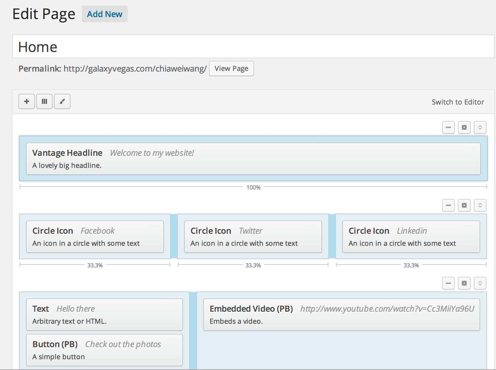
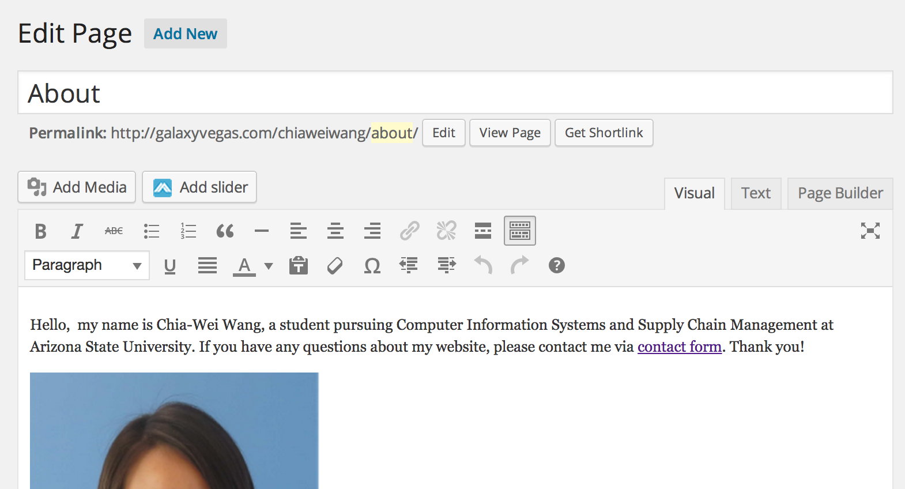
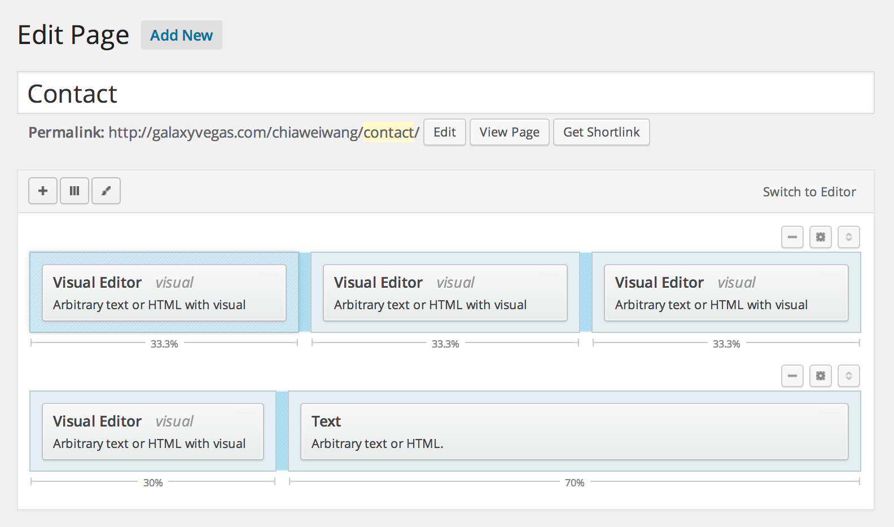
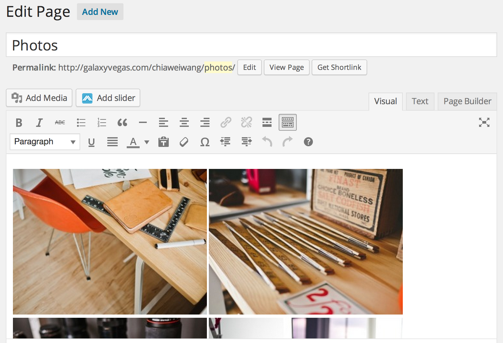

CIS440 Personal Project
============================
<h5>Chia-Wei Wang</h5>
<h5>http://galaxyvegas.com/chiaweiwang</h5>

<h5>Introduction</h5>
The personal project I decided to develop is a fully functional website build from WordPress. I choosed WordPress as a tool since many of teams use it to build website for their capstone projects. Throughout their demonstrations, I have learnt the advantages and features of WordPress. In addition, WordPress is one of the most popular open source blogging tool and content management system in the world as there are around one-fourth of websites are build from WordPress. 

During the development, I have learnt how to create a website from scratch on my own initiatives – all steps from getting hosting and domain name to installing WordPress and creating website. 

<h5>Home Page</h5>
The page in back-end is shown in screen shot, some achievements are: 
- Installed “Meta Slider” plugins to display pictures in the slider. 
- Added social media icons that direct the users to the specific websites. 
-	Added text and button that link to “Photos” page.
-	Embedded a video from YouTube.
-	Use “Page Builder” to modify page layout.

<h5>About Page</h5>

The page in back-end is shown in screen shot, some achievements are: 
-	Added text and picture
-	Enable the sidebar on the right side (search, meta and calendar)

<h5>Contact Page</h5>

The page in back-end is shown in screen shot, some achievements are: 
-	Installed “Contact Form 7” plugins. 
-	Use “Page Builder” to modify page layout.
-	Added a Google map

 
<h5>Photo Page</h5>

The page in back-end is shown in screen shot, some achievements are: 
-	Uploaded pictures to media.
-	Installed “Lightbox Plus Colorbox” plugins to popup pictures.

 
